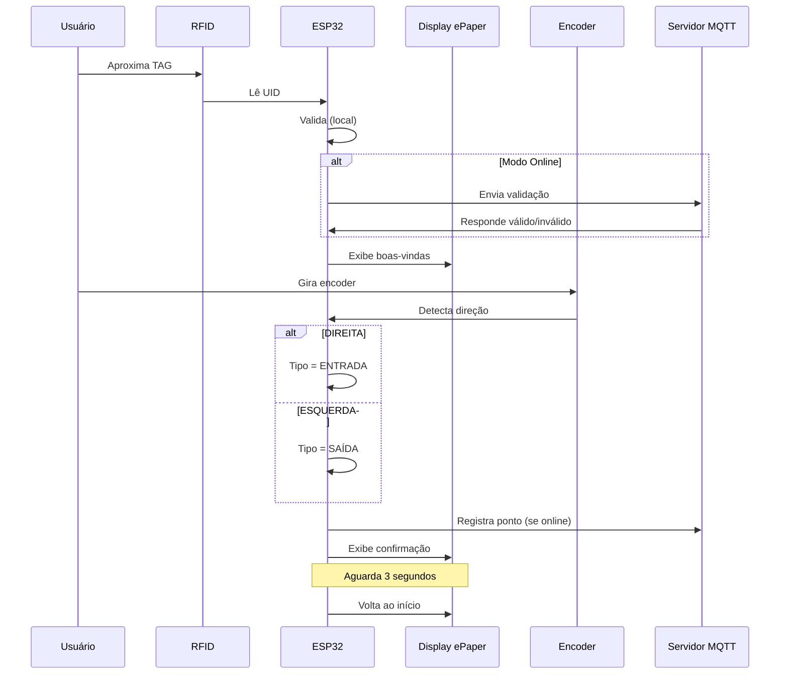

# PROJETO PONTO ELETRÔNICO IoT

O trabalho apresenta um sistema de ponto eletrônico inteligente, suportado por tecnologias de IoT. A solução integra métodos de autenticação via biometria e RFID para validar usuários. O objetivo é entregar um dispositivo totalmente conectado aos sistema geral, que não apenas registre o fluxo de entrada e saída dos colaboradores, mas também disponibilize esses dados para monitoramento e análise.

---

### Modos de Operação

**MODO OFFLINE (sem WiFi/MQTT):**
- Valida com TAG mestre configurada
- Registra apenas no Serial Monitor
- Ideal para testes

**MODO ONLINE (com WiFi/MQTT):**
- Valida com servidor Node-RED
- Envia registros para banco de dados
- Modo de produção

---

## Tecnologias Utilizadas

### Hardware
- **ESP32** - Microcontrolador principal
- **MFRC522** - Leitor RFID 13.56MHz
- **GxEPD2_290_T94_V2** - Display e-Paper 2.9"
- **Encoder Rotativo** - Detecção de direção
- **Buzzer Ativo** - alerta sonoro

### Software
- **Arduino Framework** - Desenvolvimento
- **MQTT** - Comunicação IoT
- **JSON** - Serialização de dados
- **WiFi** - Conectividade
- **Tecnologias Web** - Interface do painel

### Backend
- **Node-RED** - Processamento de fluxos
- **PostgreSQL** - Banco de dados
- **Django** - Backend do painel web

---

## Como Funciona

**Conceitual:**

**Hardware:**

