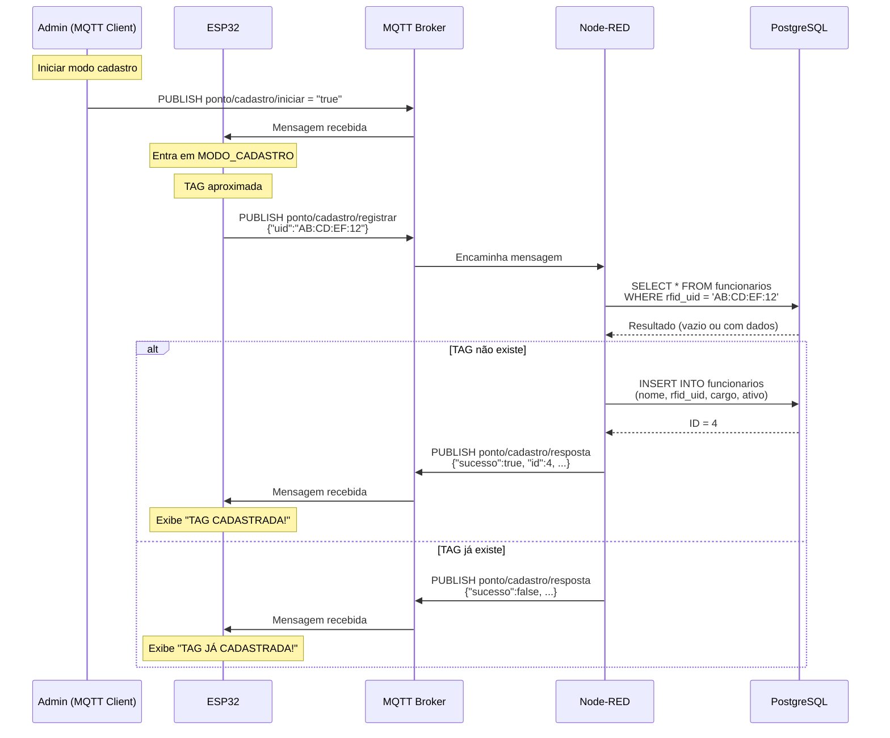

# 🆕 Fluxo de Cadastro de Funcionários - Ponto Eletrônico IoT

## 📋 Visão Geral

O sistema agora possui **DUAS formas de cadastrar** funcionários:

1. **Via API HTTP** → Para sistemas web/administrativos
2. **Via MQTT (ESP32)** → Para cadastro direto no dispositivo

---

## 🔄 Fluxo 1: Cadastro via API HTTP

### Descrição
Interface para sistemas web cadastrarem funcionários com todos os dados.

### Endpoint
```
POST /api/funcionario
Content-Type: application/json
```

### Payload
```json
{
    "nome": "Carlos Oliveira",
    "cpf": "12345678901",
    "cargo": "Analista",
    "departamento": "RH",
    "rfid_uid": "1A:2B:3C:4D"
}
```

### Resposta
```
201 Created
```

### Exemplo com curl
```bash
curl -X POST http://localhost:1880/api/funcionario \
  -H "Content-Type: application/json" \
  -d '{
    "nome": "Carlos Oliveira",
    "cpf": "12345678901",
    "cargo": "Analista",
    "departamento": "RH",
    "rfid_uid": "1A:2B:3C:4D"
  }'
```

### Funcionamento Interno
```
HTTP POST
    ↓
[Parse dados]
    ↓
[INSERT INTO funcionarios]
    ↓
[Retorna 201 Created]
    ↓
[Publica MQTT: ponto/cadastro/novo]
```

---

## 🆕 Fluxo 2: Cadastro via MQTT (ESP32)

### Descrição
Permite cadastrar novas TAGs diretamente no ESP32, útil para cadastramento rápido no local.

### Como Usar no ESP32

#### 1. Ativar Modo Cadastro
O administrador envia via MQTT:

```json
Tópico: ponto/cadastro/iniciar
Payload: "true"
```

O ESP32 muda para `MODO_CADASTRO` e exibe:
```
╔═══════════════════════════════╗
║   MODO DE CADASTRO            ║
║                               ║
║   Aproxime a nova TAG         ║
╚═══════════════════════════════╝
```

#### 2. Aproximar Nova TAG
Quando uma TAG é aproximada no modo cadastro:

```cpp
// ESP32 publica automaticamente
Tópico: ponto/cadastro/registrar
Payload: {"uid": "AB:CD:EF:12"}
```

#### 3. Node-RED Processa
```
[Recebe UID]
    ↓
[Verifica se TAG já existe]
    ↓
    ├─ Existe? → [Retorna erro]
    └─ Não existe? → [Cadastra no banco]
                          ↓
                    [Retorna sucesso]
```

#### 4. ESP32 Recebe Resposta

**Sucesso:**
```json
Tópico: ponto/cadastro/resposta
Payload: {
    "sucesso": true,
    "mensagem": "TAG cadastrada com sucesso",
    "id": 4,
    "nome": "Funcionário AB:CD:EF",
    "uid": "AB:CD:EF:12"
}
```

ESP32 exibe:
```
╔═══════════════════════════════╗
║   TAG CADASTRADA!             ║
║                               ║
║   UID: AB:CD:EF:12            ║
╚═══════════════════════════════╝
```

**Erro (TAG já existe):**
```json
Tópico: ponto/cadastro/resposta
Payload: {
    "sucesso": false,
    "mensagem": "TAG já cadastrada",
    "funcionario": "João Silva",
    "uid": "C1:71:22:0D"
}
```

ESP32 exibe:
```
╔═══════════════════════════════╗
║   TAG JÁ CADASTRADA!          ║
║                               ║
║   Funcionário: João Silva     ║
╚═══════════════════════════════╝
```

---

## 📊 Diagrama do Fluxo Completo



---

## 🔧 Configuração no ESP32

### Adicionar Novo Estado
O código já tem o estado `MODO_CADASTRO` implementado!

### Tópicos MQTT Utilizados
```cpp
// Recebe comando para entrar em modo cadastro
const char* TOPIC_CADASTRO_INICIAR = "ponto/cadastro/iniciar";

// Envia UID da nova TAG
const char* TOPIC_CADASTRO_REGISTRAR = "ponto/cadastro/registrar";

// Recebe resposta do cadastro
const char* TOPIC_CADASTRO_RESPOSTA = "ponto/cadastro/resposta";
```

### Subscribe no Setup
```cpp
void setup() {
    // ...
    mqtt.subscribe(TOPIC_CADASTRO_INICIAR);
    mqtt.subscribe(TOPIC_CADASTRO_RESPOSTA);
}
```

### Handler de Mensagens
```cpp
void recebeuMensagemMQTT(String topico, String conteudo) {
    if (topico == TOPIC_CADASTRO_INICIAR) {
        if (conteudo == "true") {
            estadoAtual = MODO_CADASTRO;
            mostrarModoCadastro();
        }
    }
    
    if (topico == TOPIC_CADASTRO_RESPOSTA) {
        JsonDocument doc;
        deserializeJson(doc, conteudo);
        
        bool sucesso = doc["sucesso"];
        String mensagem = doc["mensagem"];
        
        if (sucesso) {
            String uid = doc["uid"];
            mostrarTagCadastrada(uid);
        } else {
            String funcionario = doc["funcionario"];
            mostrarTagJaCadastrada(funcionario);
        }
        
        delay(3000);
        estadoAtual = AGUARDANDO;
        mostrarTelaInicial();
    }
}
```

---

## 🧪 Testando o Sistema

### Teste 1: Ativar Modo Cadastro

**Usando Node-RED:**
1. Adicione um nó **inject**
2. Configure:
   - Topic: `ponto/cadastro/iniciar`
   - Payload: string `"true"`
3. Conecte a um nó **mqtt out** com o broker configurado
4. Clique no botão

**Usando mosquitto_pub:**
```bash
mosquitto_pub -h mqtt.janks.dev.br -t "ponto/cadastro/iniciar" \
  -u SEU_USUARIO -P SUA_SENHA -m "true"
```

### Teste 2: Cadastrar TAG Manualmente

**Simule o ESP32 enviando uma TAG:**
```bash
mosquitto_pub -h mqtt.janks.dev.br \
  -t "ponto/cadastro/registrar" \
  -u SEU_USUARIO -P SUA_SENHA \
  -m '{"uid":"FF:EE:DD:CC"}'
```

**Verifique no Node-RED:**
- Painel Debug deve mostrar a resposta
- Banco de dados deve ter novo funcionário

**Verifique no PostgreSQL:**
```sql
SELECT * FROM funcionarios WHERE rfid_uid = 'FF:EE:DD:CC';
```

### Teste 3: Tentar Cadastrar TAG Existente

```bash
# Tente cadastrar TAG do João Silva
mosquitto_pub -h mqtt.janks.dev.br \
  -t "ponto/cadastro/registrar" \
  -u SEU_USUARIO -P SUA_SENHA \
  -m '{"uid":"C1:71:22:0D"}'
```

Deve retornar erro dizendo que TAG já está cadastrada.

---

## 📝 Dados Cadastrados Automaticamente

Quando uma TAG é cadastrada via MQTT, o sistema cria um registro com:

| Campo | Valor |
|-------|-------|
| `nome` | "Funcionário [primeiros 8 chars do UID]" |
| `rfid_uid` | UID da TAG |
| `cargo` | "A definir" |
| `ativo` | `true` |
| `cpf` | `NULL` (pode ser adicionado depois) |
| `departamento` | `NULL` (pode ser adicionado depois) |

### Editar Dados Depois

Use a API HTTP para atualizar os dados:

```bash
# TODO: Criar endpoint PUT /api/funcionario/:id
curl -X PUT http://localhost:1880/api/funcionario/4 \
  -H "Content-Type: application/json" \
  -d '{
    "nome": "Maria Costa",
    "cpf": "98765432100",
    "cargo": "Engenheira",
    "departamento": "Produção"
  }'
```

---

## 🔐 Segurança

### Controle de Acesso
⚠️ **Importante:** Qualquer um que souber os tópicos MQTT pode ativar o modo cadastro!

**Melhorias sugeridas:**
1. Adicionar senha para modo cadastro
2. Timeout automático (sair do modo após 2 minutos)
3. Limitar número de cadastros por sessão
4. Log de auditoria (quem cadastrou, quando)

### Exemplo com Senha
```cpp
void recebeuMensagemMQTT(String topico, String conteudo) {
    if (topico == TOPIC_CADASTRO_INICIAR) {
        JsonDocument doc;
        deserializeJson(doc, conteudo);
        
        String senha = doc["senha"];
        if (senha == "SENHA_ADMIN_123") {
            estadoAtual = MODO_CADASTRO;
        } else {
            Serial.println("ERRO: Senha incorreta");
        }
    }
}
```

---

## 📈 Estatísticas e Relatórios

### Contar TAGs Cadastradas Hoje
```sql
SELECT COUNT(*) FROM funcionarios 
WHERE DATE(data_cadastro) = CURRENT_DATE;
```

### Últimas TAGs Cadastradas
```sql
SELECT id, nome, rfid_uid, data_cadastro 
FROM funcionarios 
ORDER BY data_cadastro DESC 
LIMIT 10;
```

### Funcionários com Dados Incompletos
```sql
SELECT id, nome, rfid_uid 
FROM funcionarios 
WHERE cpf IS NULL OR cargo = 'A definir'
ORDER BY data_cadastro DESC;
```

---

## 🎯 Próximos Passos

### Funcionalidades Sugeridas:
- [ ] **Editar funcionário via API** (PUT /api/funcionario/:id)
- [ ] **Deletar funcionário** (DELETE /api/funcionario/:id)
- [ ] **Listar funcionários** (GET /api/funcionarios)
- [ ] **Buscar por CPF/Nome** (GET /api/funcionario?cpf=xxx)
- [ ] **Desativar funcionário** (PATCH /api/funcionario/:id/desativar)
- [ ] **Modo cadastro com timeout** (sai automaticamente após 2 min)
- [ ] **Auditoria de cadastros** (tabela separada para logs)
- [ ] **Validação de UID** (formato correto, não duplicado)
- [ ] **Foto do funcionário** (upload via web)
- [ ] **QR Code para cadastro** (gerar QR, escanear no ESP32)

---

## 🆘 Troubleshooting

### Problema: ESP32 não entra em modo cadastro
**Verificar:**
- Subscribe no tópico `ponto/cadastro/iniciar`
- Handler implementado no `recebeuMensagemMQTT`
- Mensagem é string "true" (não boolean)

### Problema: TAG não é cadastrada
**Verificar:**
- Node-RED recebeu mensagem (debug)
- Formato JSON correto: `{"uid":"AB:CD:EF:12"}`
- PostgreSQL rodando e acessível
- Sem erros no log do Node-RED

### Problema: TAG duplicada
**Verificar:**
- Constraint UNIQUE no campo `rfid_uid`
- Fluxo Node-RED verifica antes de inserir
- Mensagem de erro sendo enviada de volta

---

## 📚 Referências

- **Código ESP32**: `src/main.cpp` - Estados e handlers MQTT
- **Fluxo Node-RED**: `fluxo_nodered.json` - Grupo 4
- **Database**: `init_database.sql` - Schema e constraints
- **Documentação**: `DOCUMENTACAO.md` - Arquitetura completa

---

**Sistema de cadastro completo e funcional! 🚀**
