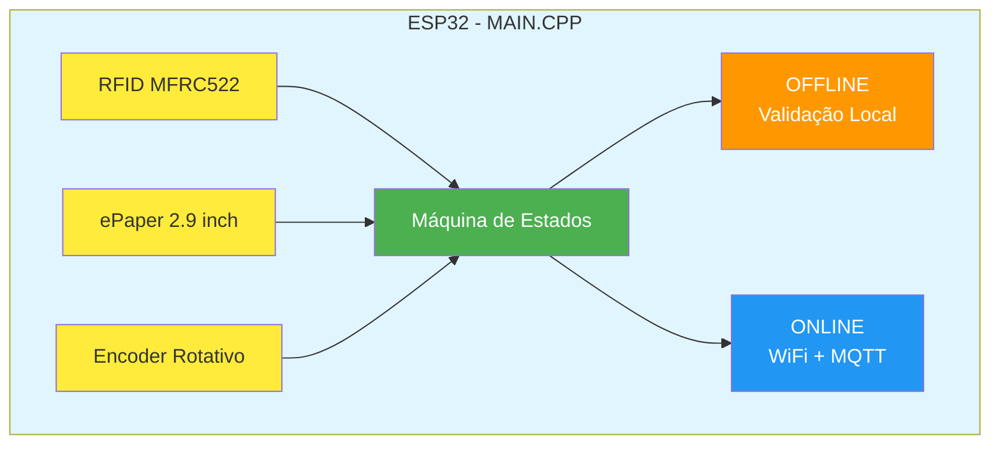
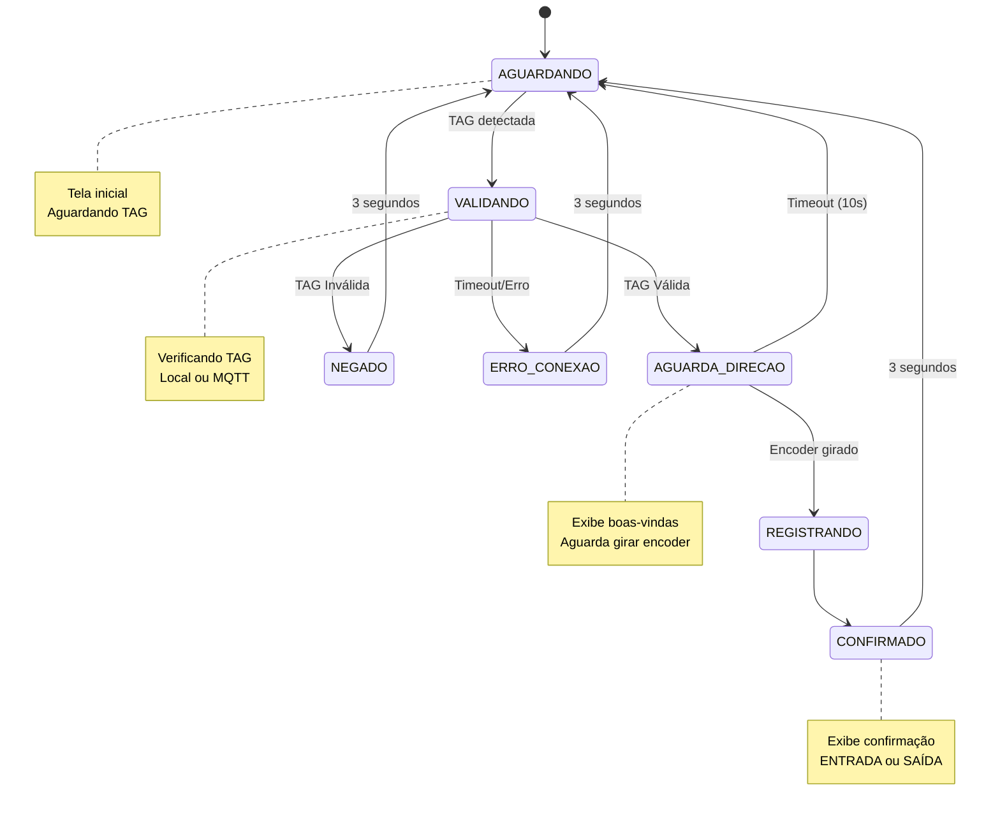
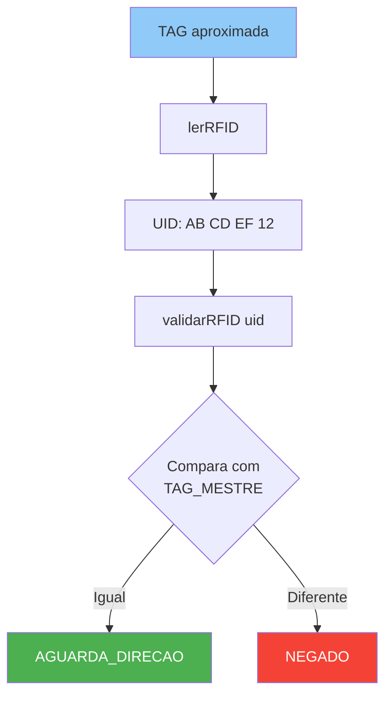
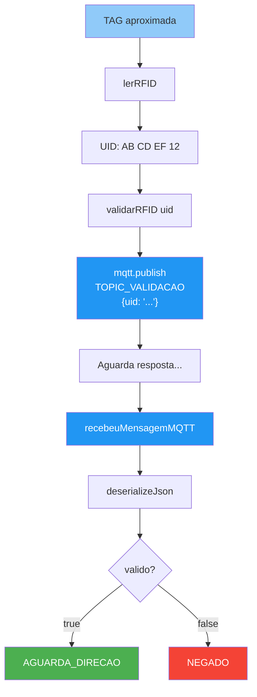
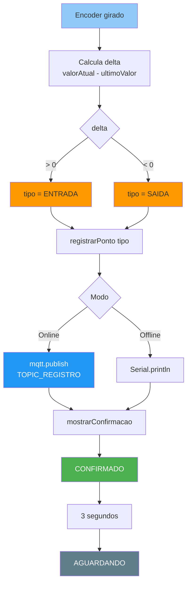
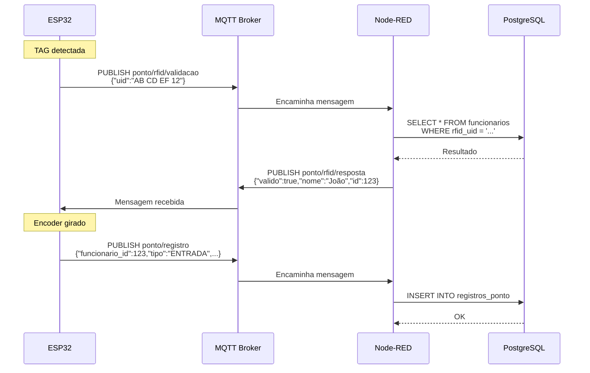

# DOCUMENTAÇÃO

## Visão Geral do Código

### Arquitetura



---

## Estrutura do Código

### 1. Bibliotecas e Dependências

```cpp
#include <SPI.h>              // Comunicação SPI (RFID + ePaper)
#include <MFRC522.h>           // Leitor RFID
#include <GxEPD2_BW.h>         // Display ePaper
#include <U8g2_for_Adafruit_GFX.h> // Fontes para ePaper
#include <ESP32Encoder.h>      // Encoder rotativo
#include <WiFi.h>              // Conexão WiFi
#include <MQTT.h>              // Cliente MQTT
#include <WiFiClient.h>        // Cliente WiFi para MQTT
#include <ArduinoJson.h>       // Serialização JSON
```

---

### 2. Configurações (Linhas 30-60)

Todas as configurações estão centralizadas no topo do arquivo:

- **WiFi**: SSID e senha
- **MQTT**: Broker, porta, credenciais, tópicos
- **TAG_MESTRE**: UID da tag para modo offline
- **Pinos**: Definições de GPIO para cada componente

**Por que centralizar?**
- Facilita ajustes rápidos
- Evita buscar valores no meio do código
- Permite criar config.h no futuro

---

### 3. Objetos Globais (Linhas 70-90)

```cpp
MFRC522 rfid(RFID_SS_PIN, RFID_RST_PIN);
GxEPD2_BW<...> tela(modeloTela);
U8G2_FOR_ADAFRUIT_GFX fontes;
ESP32Encoder encoder;
WiFiClient conexaoWiFi;
MQTTClient mqtt(1024);
```

**Singleton Pattern**: Instâncias únicas de cada periférico

---

### 4. Máquina de Estados

#### Estados Definidos

```cpp
enum Estado { 
  AGUARDANDO,      // Estado inicial - aguardando TAG
  VALIDANDO,       // Verificando TAG (local ou MQTT)
  AGUARDA_DIRECAO, // TAG válida - aguardando girar encoder
  REGISTRANDO,     // Enviando registro para servidor
  CONFIRMADO,      // Exibindo confirmação
  NEGADO,          // TAG inválida
  ERRO_CONEXAO     // Falha de comunicação
};
```

#### Transições de Estado



---

### 5. Funções Principais

#### 5.1 Rede e MQTT

**`reconectarWiFi()`**
- Verifica status da conexão
- Tenta conectar com timeout de 10 segundos
- Define `modoOffline = true` se falhar

**`reconectarMQTT()`**
- Conecta ao broker MQTT
- Subscreve tópico de resposta
- Define modo online/offline

**`recebeuMensagemMQTT(String topico, String conteudo)`**
- Callback para mensagens MQTT
- Deserializa JSON
- Extrai dados do usuário (nome, id, validade)
- Muda estado para AGUARDA_DIRECAO ou NEGADO

#### 5.2 RFID

**`String lerRFID()`**
- Lê bytes do UID
- Formata como string hexadecimal: "AB CD EF 12"
- Retorna em maiúsculas

#### 5.3 Validação

**`validarRFID(String uid)`**
- **Modo Offline**: Compara UID com TAG_MESTRE
- **Modo Online**: Publica no tópico MQTT `ponto/rfid/validacao`
- Define próximo estado baseado no resultado

**JSON enviado (online):**
```json
{
  "uid": "AB CD EF 12"
}
```

**JSON esperado (resposta):**
```json
{
  "valido": true,
  "nome": "João Silva",
  "id": 123
}
```

#### 5.4 Registro de Ponto

**`registrarPonto(String tipo)`**
- Captura timestamp (millis/1000 ou RTC futuro)
- **Modo Online**: Publica no tópico `ponto/registro`
- **Modo Offline**: Apenas registra no Serial
- Exibe confirmação no display

**JSON enviado:**
```json
{
  "funcionario_id": 123,
  "tipo": "ENTRADA",
  "timestamp": "1234567890",
  "metodo": "rfid"
}
```

#### 5.5 Display ePaper

**6 funções de tela:**

1. `mostrarTelaInicial()` - Tela de espera com status
2. `mostrarVerificando()` - Mensagem "Verificando..."
3. `mostrarBoasVindas(String nome)` - Saudação personalizada
4. `mostrarConfirmacao(String tipo, String horario)` - Ponto registrado
5. `mostrarAcessoNegado()` - TAG não cadastrada
6. `mostrarErroConexao()` - Falha MQTT

**Padrão de uso:**
```cpp
tela.fillScreen(GxEPD_WHITE);        // Limpa tela
fontes.setFont(u8g2_font_...);       // Define fonte
fontes.setFontMode(1);                // Modo opaco
fontes.setCursor(x, y);               // Posiciona cursor
fontes.print("Texto");                // Escreve
tela.display(true);                   // Atualiza display
```

**Fontes utilizadas:**
- `u8g2_font_helvB24_te` - Títulos grandes
- `u8g2_font_helvB18_te` - Subtítulos
- `u8g2_font_helvR14_te` - Texto normal
- `u8g2_font_helvB14_te` - Texto destacado
- `u8g2_font_helvR10_te` - Texto pequeno

---

### 6. Setup (Inicialização)

**Ordem de inicialização:**

1. **Serial** (115200 baud) - Debug
2. **SPI** - Barramento compartilhado
3. **RFID** - `rfid.PCD_Init()`
4. **ePaper** - `tela.init()` + rotação + fontes
5. **Encoder** - Pull-ups + attach + clear
6. **WiFi** - Tentativa de conexão (com timeout)
7. **MQTT** - Se WiFi conectado (com timeout)
8. **Tela Inicial** - Exibe status
9. **Estado AGUARDANDO** - Pronto para uso

**Tratamento de falhas:**
- WiFi falhou → Modo OFFLINE
- MQTT falhou → Modo OFFLINE
- Hardware falhou → Serial mostra erro

---

### 7. Loop Principal

**Estrutura:**

```cpp
void loop() {
  // 1. Manutenção de conexões (se online)
  if (!modoOffline) {
    reconectarWiFi();
    reconectarMQTT();
    mqtt.loop();  // Processa mensagens MQTT
  }
  
  // 2. Máquina de estados
  switch (estadoAtual) {
    case AGUARDANDO:
      // Detecta nova TAG
      break;
    case VALIDANDO:
      // Aguarda resposta (com timeout)
      break;
    case AGUARDA_DIRECAO:
      // Monitora encoder (com timeout)
      break;
    case CONFIRMADO:
      // Aguarda 3s e volta
      break;
    case NEGADO:
      // Aguarda 3s e volta
      break;
    case ERRO_CONEXAO:
      // Aguarda 3s e volta
      break;
  }
}
```

**Características:**
- **Non-blocking**: Usa `millis()` para timeouts
- **Polling**: Verifica encoder a cada loop
- **Event-driven**: MQTT processa mensagens via callback

---

## Fluxos de Dados

### Fluxo 1: Validação Offline



### Fluxo 2: Validação Online



### Fluxo 3: Registro de Ponto



---

## Timeouts e Temporizadores

### Variáveis de Tempo

```cpp
unsigned long instanteAnterior = 0;   // Timer genérico
unsigned long instanteTimeout = 0;    // Timer do encoder
const long DURACAO_MENSAGEM = 3000;   // 3 segundos
const long TIMEOUT_ENCODER = 10000;   // 10 segundos
```

### Uso de `millis()`

**Padrão:**
```cpp
// Iniciar timer
instanteAnterior = millis();

// Verificar se expirou
unsigned long agora = millis();
if (agora - instanteAnterior > DURACAO_MENSAGEM) {
  // Timeout atingido
}
```

**Por que não usar `delay()`?**
- `delay()` bloqueia todo o código
- Encoder não seria lido durante delay
- MQTT não processaria mensagens
- Display não seria atualizado

---

## Encoder Rotativo

### Funcionamento

```cpp
ESP32Encoder::useInternalWeakPullResistors = UP;  // Ativa pull-ups
encoder.attachFullQuad(ENCODER_DT_PIN, ENCODER_CLK_PIN);  // Modo quadratura
encoder.clearCount();  // Zera contador
```

### Leitura de Direção

```cpp
long valorAtual = encoder.getCount();
long delta = valorAtual - ultimoValorEncoder;

if (delta > 0) {
  // Girou para DIREITA (horário) → ENTRADA
} else if (delta < 0) {
  // Girou para ESQUERDA (anti-horário) → SAÍDA
}

ultimoValorEncoder = valorAtual;  // Atualiza referência
```

**Quadratura completa:**
- Detecta 4 pulsos por detent (clique)
- Alta resolução
- Detecta direção com precisão

---

## Comunicação MQTT

### Diagrama de Comunicação



### Tópicos

| Tópico | Direção | Payload | Descrição |
|--------|---------|---------|-----------|
| `ponto/rfid/validacao` | ESP → Server | `{"uid":"..."}` | Solicita validação |
| `ponto/rfid/resposta` | Server → ESP | `{"valido":bool, "nome":"...", "id":int}` | Resposta da validação |
| `ponto/registro` | ESP → Server | `{"funcionario_id":int, "tipo":"...", "timestamp":"...", "metodo":"rfid"}` | Registra ponto |

### QoS (Quality of Service)

```cpp
mqtt.subscribe(TOPIC_RESPOSTA);  // QoS 0 (padrão)
mqtt.publish(TOPIC_VALIDACAO, payload);  // QoS 0
```

**QoS 0 (At most once):**
- Sem confirmação
- Mais rápido
- Pode perder mensagens (raro em LAN)

**Alternativa QoS 1 (futuro):**
```cpp
mqtt.subscribe(TOPIC_RESPOSTA, 1);
mqtt.publish(TOPIC_VALIDACAO, payload, false, 1);
```

---

## Otimizações Implementadas

### 1. Variáveis Estáticas

```cpp
static bool telaExibida = false;
if (!telaExibida) {
  mostrarBoasVindas(nome);
  telaExibida = true;
}
```

**Vantagem:** Evita redesenhar tela ePaper a cada loop (é lento!)

### 2. Buffer MQTT

```cpp
MQTTClient mqtt(1024);  // 1KB de buffer
```

**Vantagem:** Suporta payloads JSON grandes

### 3. Timeout Duplo

- `instanteAnterior` - Timer genérico (mensagens)
- `instanteTimeout` - Timer do encoder
- Evita conflito entre timers

### 4. Modo Offline Automático

```cpp
bool modoOffline = true;  // Assume offline
// ... tenta conectar ...
if (sucesso) {
  modoOffline = false;
}
```

**Vantagem:** Sistema funciona mesmo sem rede

---

## Possíveis Melhorias Futuras

### 1. Configuração via Web

```cpp
#include <WebServer.h>
WebServer server(80);
// Página para configurar WiFi/MQTT sem recompilar
```

### 2. RTC (Real-Time Clock)

```cpp
#include <RTClib.h>
RTC_DS3231 rtc;
// Timestamp real em vez de millis()
```

### 3. Armazenamento Offline

```cpp
#include <LittleFS.h>
// Salvar registros quando offline
// Sincronizar quando reconectar
```

### 4. Watchdog Timer

```cpp
#include <esp_task_wdt.h>
// Reinicia ESP32 se travar
```

### 5. OTA (Over-The-Air Update)

```cpp
#include <ArduinoOTA.h>
// Atualizar firmware via WiFi
```

---

## Memória e Performance

### Uso de RAM

Estimativa:
- Objetos globais: ~2KB
- Stack: ~1KB
- MQTT buffer: 1KB
- Display buffer: ~5KB
- **Total: ~9KB de 320KB** (ESP32)

### Uso de Flash

- Código compilado: ~800KB
- Bibliotecas: ~400KB
- **Total: ~1.2MB de 4MB**

### Velocidade

- Loop principal: ~1000 Hz (1ms por iteração)
- RFID polling: ~100 Hz
- Display update: ~2-3 segundos (e-ink é lento)
- Encoder responsivo: < 10ms

---

## Segurança

### Implementado

✅ Validação de UID via servidor  
✅ Credenciais em constantes (não hardcoded em múltiplos lugares)

### Não Implementado (Melhorias Futuras)

❌ MQTT sem TLS (porta 1883)  
❌ Credenciais no código (usar LittleFS)  
❌ Sem autenticação do ESP32  
❌ Payloads JSON sem assinatura

**Para produção:**
```cpp
#include <WiFiClientSecure.h>
WiFiClientSecure conexaoSegura;
conexaoSegura.setCACert(certificado);
mqtt.begin(MQTT_BROKER, 8883, conexaoSegura);
```

---

## Debugging

### Mensagens Serial

O código usa Serial.println() extensivamente:

```
[OK] - Sucesso
[AVISO] - Atenção
[INFO] - Informação
[ERRO] - Falha
--- TAG DETECTADA --- - Evento importante
```

### Dicas de Debug

1. **RFID não detecta:**
   ```cpp
   Serial.print("Firmware version: 0x");
   Serial.println(rfid.PCD_ReadRegister(MFRC522::VersionReg), HEX);
   // Deve retornar 0x91 ou 0x92
   ```

2. **Encoder não responde:**
   ```cpp
   Serial.println("Encoder: " + String(encoder.getCount()));
   // Adicionar no loop, ver se conta muda
   ```

3. **Display travado:**
   ```cpp
   Serial.println("Display BUSY: " + String(digitalRead(EPAPER_BUSY)));
   // Deve ser LOW quando pronto
   ```

---
