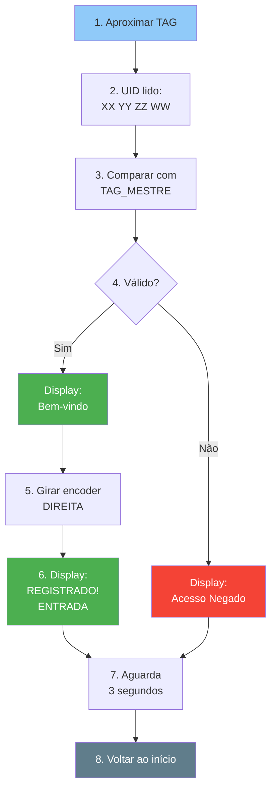

# ⚡ META 1 - REFERÊNCIA RÁPIDA

## Checklist Antes de Compilar

```
┌─────────────────────────────────────────────────┐
│  ☐ Bibliotecas instaladas (6 no total)         │
│  ☐ TAG_MESTRE configurada com UID real          │
│  ☐ Pinagem conferida (RFID, ePaper, Encoder)   │
│  ☐ WiFi/MQTT configurado (ou desabilitado)     │
│  ☐ Serial Monitor em 115200 baud               │
└─────────────────────────────────────────────────┘
```

---

## Configurações Mínimas (Modo Offline)

```cpp
// NO TOPO DO main.cpp (linha ~30)

// 1. WiFi - deixe inválido para forçar modo offline
const char* WIFI_SSID = "REDE_FALSA";
const char* WIFI_PASSWORD = "SENHA_FALSA";

// 2. TAG Mestre - TROCAR PELO SEU UID!
const char* TAG_MESTRE = "04 A2 3C 12";  // <-- TROCAR!
```

**Como descobrir seu UID:**
1. Compile e suba o código
2. Aproxime TAG
3. Serial mostra: `UID: XX YY ZZ WW`
4. Copie e cole em `TAG_MESTRE`

---

## Pinagem Padrão

| Componente | Sinal | GPIO | Cor Sugerida |
|------------|-------|------|--------------|
| **RFID** | SDA/SS | 46 | Azul |
| | RST | 17 | Amarelo |
| | SCK | SCK | Branco |
| | MOSI | MOSI | Verde |
| | MISO | MISO | Roxo |
| | 3.3V | 3.3V | Vermelho |
| | GND | GND | Preto |
| **ePaper** | SS | 10 | Azul |
| | DC | 14 | Amarelo |
| | RST | 15 | Verde |
| | BUSY | 16 | Branco |
| | SCK | SCK | Cinza |
| | MOSI | MOSI | Laranja |
| | 3.3V | 3.3V | Vermelho |
| | GND | GND | Preto |
| **Encoder** | CLK | 34 | Verde |
| | DT | 35 | Azul |
| | GND | GND | Preto |

---

## Bibliotecas Arduino IDE

**Menu: Sketch → Include Library → Manage Libraries**

```
1. MFRC522          by GithubCommunity        [Instalar]
2. GxEPD2           by Jean-Marc Zingg        [Instalar]
3. U8g2_for_Adafruit_GFX  by olikraus        [Instalar]
4. ESP32Encoder     by Kevin Harrington      [Instalar]
5. MQTT             by Joel Gaehwiler        [Instalar]
6. ArduinoJson      by Benoit Blanchon       [Instalar]
```

---

## Comandos Serial Monitor

### Mensagens Importantes

```
[OK]     - Componente inicializado
[AVISO]  - Modo offline ou problema menor
[INFO]   - Informação de estado
[ERRO]   - Falha crítica

--- TAG DETECTADA ---  (nova tag aproximada)
UID: XX YY ZZ WW       (identificador da tag)
TAG VALIDA (offline)   (autenticação OK)
TAG INVALIDA (offline) (autenticação FALHOU)
```

### Saída Esperada (Sucesso)

```
=================================
PONTO ELETRONICO - META 1
=================================

[OK] Leitor RFID iniciado
[OK] Display ePaper iniciado
[OK] Encoder iniciado

[AVISO] Operando em MODO OFFLINE

=================================
Sistema pronto! Aproxime uma TAG.
=================================
```

---

## Testes Rápidos

### Teste 1: Hardware Básico (30 segundos)

```
1. Suba código
2. Veja Serial: [OK] x3
3. Veja Display: "PONTO ELETRÔNICO"
✓ Se passou, hardware OK
```

### Teste 2: RFID (1 minuto)

```
1. Aproxime qualquer TAG
2. Serial mostra: "UID: XX YY ZZ WW"
3. Display muda para "Verificando..."
✓ Se passou, RFID OK
```

### Teste 3: TAG Válida (2 minutos)

```
1. Configure TAG_MESTRE com UID correto
2. Recompile e suba
3. Aproxime TAG
4. Display mostra: "Bem-vindo(a), Usuario Teste"
✓ Se passou, validação OK
```

### Teste 4: Encoder (1 minuto)

```
1. Após TAG válida
2. Gire encoder para DIREITA
3. Serial: "Encoder girou para DIREITA -> ENTRADA"
4. Display: "REGISTRADO! Tipo: ENTRADA"
✓ Se passou, encoder OK
```

---

## Troubleshooting Express

### Problema → Solução Rápida

**Display não acende**
```
→ Confira alimentação 3.3V
→ Aperte cabo flat
→ Troque pino BUSY (16 → outro GPIO)
```

**RFID não detecta**
```
→ Aproxime TAG < 2cm
→ Confira pino SS (46)
→ Teste com DumpInfo example
```

**Encoder não gira**
```
→ Troque CLK ↔ DT no código
→ Teste com Serial.println(encoder.getCount())
→ Verifique pull-ups
```

**WiFi não conecta**
```
→ Rede é 2.4GHz?
→ SSID correto (case-sensitive)?
→ ESP32 perto do roteador?
```

**Código não compila**
```
→ Bibliotecas instaladas?
→ Placa selecionada: ESP32 Dev Module?
→ Porta USB correta?
```

---

## Estados da Máquina

```
AGUARDANDO       → Tela inicial, aguardando TAG
VALIDANDO        → "Verificando..." no display
AGUARDA_DIRECAO  → "Bem-vindo, gire para..."
CONFIRMADO       → "REGISTRADO! Tipo: X"
NEGADO           → "ACESSO NEGADO"
ERRO_CONEXAO     → "ERRO DE CONEXAO"
```

**Tempo em cada estado:**
- AGUARDANDO: Infinito (até TAG)
- VALIDANDO: Até 5s (timeout)
- AGUARDA_DIRECAO: Até 10s (timeout)
- CONFIRMADO: 3s
- NEGADO: 3s
- ERRO_CONEXAO: 3s

---

## Fluxo Feliz (Modo Offline)



**Tempo total:** ~10 segundos

---

## Modificações Comuns

### Mudar Timeout do Encoder

```cpp
// Linha ~100
const long TIMEOUT_ENCODER = 10000;   // 10 segundos
                              ↑
                          mude aqui (em milissegundos)
```

### Adicionar Nova TAG Mestre

```cpp
// Linha ~45
const char* TAG_MESTRE = "04 A2 3C 12";

// Para múltiplas TAGs (futuro):
const char* TAGS_MESTRES[] = {
  "04 A2 3C 12",
  "11 22 33 44",
  "AA BB CC DD"
};
```

### Mudar Mensagem do Display

```cpp
// Função mostrarTelaInicial() (linha ~200)
fontes.print("Aproxime sua TAG/Cartao");
             ↑
       mude o texto aqui
```

### Inverter Direção do Encoder

```cpp
// Função loop(), estado AGUARDA_DIRECAO (linha ~450)
if (delta > 0) {
  tipo = "ENTRADA";  // <-- trocar com linha abaixo
} else {
  tipo = "SAIDA";    // <-- trocar com linha acima
}
```

---

## Valores Padrão

```cpp
DURACAO_MENSAGEM = 3000    // 3 segundos
TIMEOUT_ENCODER = 10000    // 10 segundos
TIMEOUT_VALIDACAO = 5000   // 5 segundos (implícito)

MQTT_BUFFER = 1024         // 1KB
SERIAL_BAUD = 115200       // bits/segundo

DISPLAY_ROTATION = 3       // Paisagem
```

---

## Tópicos MQTT

```
Publicados pelo ESP32:
  ponto/rfid/validacao → {"uid":"XX YY ZZ WW"}
  ponto/registro       → {"funcionario_id":123, ...}

Subscritos pelo ESP32:
  ponto/rfid/resposta  ← {"valido":true, "nome":"João", ...}
```

---

## JSON Payloads

**Validação (ESP → Server):**
```json
{
  "uid": "04 A2 3C 12"
}
```

**Resposta (Server → ESP):**
```json
{
  "valido": true,
  "nome": "João Silva",
  "id": 123
}
```

**Registro (ESP → Server):**
```json
{
  "funcionario_id": 123,
  "tipo": "ENTRADA",
  "timestamp": "1234567890",
  "metodo": "rfid"
}
```

---

## Fontes do Display

```cpp
u8g2_font_helvB24_te  → Helvetica Bold 24pt
u8g2_font_helvB18_te  → Helvetica Bold 18pt
u8g2_font_helvR14_te  → Helvetica Regular 14pt
u8g2_font_helvB14_te  → Helvetica Bold 14pt
u8g2_font_helvR10_te  → Helvetica Regular 10pt
```

**Trocar fonte:**
```cpp
fontes.setFont(u8g2_font_helvB24_te);
               ↑
        nome da fonte aqui
```

**Outras fontes disponíveis:**
- https://github.com/olikraus/u8g2/wiki/fntlistall

---

## Debug Rápido

### Ver Contador do Encoder

Adicione no `loop()`:
```cpp
Serial.println("Encoder: " + String(encoder.getCount()));
delay(100);
```

### Ver Status MQTT

Adicione no `loop()`:
```cpp
Serial.println("MQTT: " + String(mqtt.connected()));
delay(1000);
```

### Ver Memória Livre

Adicione no `setup()`:
```cpp
Serial.println("RAM livre: " + String(ESP.getFreeHeap()));
```

---

## Configuração Arduino IDE

```
Placa:              ESP32 Dev Module
Upload Speed:       921600
Flash Frequency:    80MHz
Flash Mode:         QIO
Flash Size:         4MB (32Mb)
Partition Scheme:   Default 4MB with spiffs
Core Debug Level:   None (ou Info para debug)
```

---

## Atalhos Úteis

```
Ctrl+R          Compilar (Verify)
Ctrl+U          Upload para ESP32
Ctrl+Shift+M    Abrir Serial Monitor
Ctrl+T          Auto-format code
Ctrl+F          Buscar no código
Ctrl+,          Abrir preferências
```

---

## Links Úteis

**Datasheets:**
- MFRC522: https://www.nxp.com/docs/en/data-sheet/MFRC522.pdf
- ESP32: https://www.espressif.com/sites/default/files/documentation/esp32_datasheet_en.pdf
- ePaper: https://www.waveshare.com/2.9inch-e-paper.htm

**Bibliotecas:**
- MFRC522: https://github.com/miguelbalboa/rfid
- GxEPD2: https://github.com/ZinggJM/GxEPD2
- ESP32Encoder: https://github.com/madhephaestus/ESP32Encoder

---

## Contatos

**Documentação:**
- `META1_GUIA_TESTE.md` - Guia passo a passo
- `META1_DOCUMENTACAO.md` - Detalhes técnicos
- `projeto.md` - Roadmap completo
- `resumo.md` - Referências de código

**Arquivos:**
- `main.cpp` - Código principal
- `/home/eduardo/PROJ-IOT/projeto-iot/`

---

**Última atualização:** 03/11/2025  
**Versão:** META 1
