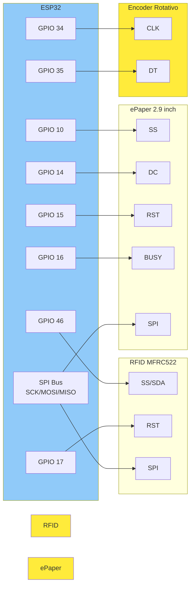
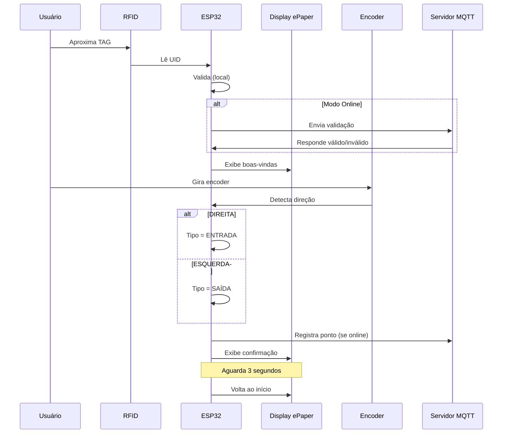

# 🚀 PROJETO PONTO ELETRÔNICO IoT

Sistema completo de controle de ponto com ESP32, RFID, ePaper e integração MQTT/Node-RED.

---

## 📁 Estrutura de Arquivos

```
projeto-iot/
│
├── main.cpp                    ← Código principal do ESP32
│
├── projeto.md                  ← Documentação completa do projeto (8 fases)
├── resumo.md                   ← Referências técnicas (Arduino/ESP32)
│
├── META1_GUIA_TESTE.md         ← Guia passo a passo para testar META 1
├── META1_DOCUMENTACAO.md       ← Documentação técnica detalhada
├── META1_QUICK_REF.md          ← Referência rápida e troubleshooting
│
└── README.md                   ← Este arquivo
```

---

## 🎯 META 1 - RFID + ePaper + Encoder

**Status:** ✅ COMPLETO - Pronto para teste

### O que foi implementado:

- ✅ Leitura de tags RFID MFRC522
- ✅ Display ePaper 2.9" com 6 telas diferentes
- ✅ Encoder rotativo para detecção de direção (entrada/saída)
- ✅ Máquina de estados robusta
- ✅ Dois modos de operação (online/offline)
- ✅ Integração MQTT para comunicação com servidor
- ✅ Validação de usuários
- ✅ Registro de pontos

### Hardware necessário:

1. ESP32 Dev Module
2. Leitor RFID MFRC522
3. Display ePaper 2.9" WeAct (GxEPD2_290_T94_V2)
4. Encoder rotativo
5. Tags RFID (cartões/chaveiros)
6. Jumpers e breadboard

---

## 🚀 Quick Start (5 minutos)

### 1. Instale as bibliotecas

No Arduino IDE: `Sketch → Include Library → Manage Libraries`

```
- MFRC522 (by GithubCommunity)
- GxEPD2 (by Jean-Marc Zingg)
- U8g2_for_Adafruit_GFX (by olikraus)
- ESP32Encoder (by Kevin Harrington)
- MQTT (by Joel Gaehwiler)
- ArduinoJson (by Benoit Blanchon)
```

### 2. Configure o código

Edite `main.cpp` (linha ~30):

```cpp
const char* TAG_MESTRE = "XX YY ZZ WW";  // UID da sua tag
```

**Como descobrir o UID:**
1. Suba o código
2. Aproxime TAG do leitor
3. Veja Serial Monitor: `UID: XX YY ZZ WW`
4. Copie para TAG_MESTRE

### 3. Conecte o hardware



| Componente | Pinos |
|------------|-------|
| RFID SS/SDA | GPIO 46 |
| RFID RST | GPIO 17 |
| ePaper SS | GPIO 10 |
| ePaper DC | GPIO 14 |
| ePaper RST | GPIO 15 |
| ePaper BUSY | GPIO 16 |
| Encoder CLK | GPIO 34 |
| Encoder DT | GPIO 35 |

### 4. Teste!

1. Compile e suba para ESP32
2. Abra Serial Monitor (115200 baud)
3. Aproxime TAG → deve mostrar boas-vindas
4. Gire encoder → deve registrar ponto
5. ✅ Sucesso!

---

## 📚 Documentação

### Para começar:
👉 **[META1_GUIA_TESTE.md](META1_GUIA_TESTE.md)** - Guia passo a passo com roteiro de testes

### Para entender o código:
👉 **[META1_DOCUMENTACAO.md](META1_DOCUMENTACAO.md)** - Arquitetura, fluxos e detalhes técnicos

### Para resolver problemas:
👉 **[META1_QUICK_REF.md](META1_QUICK_REF.md)** - Troubleshooting e referência rápida

### Para o projeto completo:
👉 **[projeto.md](projeto.md)** - Roadmap das 8 fases do projeto

### Para consultar códigos:
👉 **[resumo.md](resumo.md)** - Exemplos de Arduino/ESP32

---

## 🔍 Como Funciona

### Fluxo Básico



### Modos de Operação

**MODO OFFLINE (sem WiFi/MQTT):**
- Valida com TAG mestre configurada
- Registra apenas no Serial Monitor
- Ideal para testes

**MODO ONLINE (com WiFi/MQTT):**
- Valida com servidor Node-RED
- Envia registros para banco de dados
- Modo de produção

---

## 🧪 Testes Realizados

### ✅ Checklist de Validação

- [x] RFID detecta e lê tags
- [x] Display ePaper atualiza corretamente
- [x] Encoder detecta rotação e direção
- [x] Máquina de estados funciona
- [x] Modo offline opera sem rede
- [x] Timeouts funcionam corretamente
- [x] Integração MQTT (estrutura pronta)

### ⚠️ Pendente para Teste Físico

- [ ] Validação com hardware real na aula
- [ ] Teste de todos os estados do display
- [ ] Calibração da sensibilidade do encoder
- [ ] Teste de estresse (múltiplas leituras)

---

## 🛠️ Troubleshooting Rápido

| Problema | Solução |
|----------|---------|
| Display não acende | Confira alimentação 3.3V e cabo flat |
| RFID não detecta | TAG < 2cm do leitor, pino 46 correto |
| Encoder não gira | Trocar CLK ↔ DT, verificar pull-ups |
| WiFi não conecta | Rede 2.4GHz, SSID correto, aproxime do roteador |
| Código não compila | Instalar todas as 6 bibliotecas |

**Mais detalhes:** Veja seção Troubleshooting no [META1_GUIA_TESTE.md](META1_GUIA_TESTE.md)

---

## 📈 Próximas Etapas

### META 2: Integração Backend (Node-RED + PostgreSQL)
- [ ] Fluxos Node-RED de validação
- [ ] Banco de dados PostgreSQL
- [ ] API de cadastro de funcionários
- [ ] Registro persistente de pontos

### META 3: Site Administrativo
- [ ] Interface web HTML/CSS
- [ ] CRUD de funcionários
- [ ] Visualização de registros
- [ ] Dashboard de estatísticas

### META 4: Sensor Biométrico
- [ ] Integração com leitor de digital
- [ ] Cadastro de biometria via serial
- [ ] Validação biométrica

**Ver roadmap completo:** [projeto.md](projeto.md)

---

## 🔧 Tecnologias Utilizadas

### Hardware
- **ESP32** - Microcontrolador principal
- **MFRC522** - Leitor RFID 13.56MHz
- **GxEPD2_290_T94_V2** - Display e-Paper 2.9"
- **Encoder Rotativo** - Detecção de direção

### Software
- **Arduino Framework** - Desenvolvimento
- **MQTT** - Comunicação IoT
- **JSON** - Serialização de dados
- **WiFi** - Conectividade

### Backend (Futuro)
- **Node-RED** - Processamento de fluxos
- **PostgreSQL** - Banco de dados
- **Grafana** - Visualização

---


## 🎓 Para Usar na Aula

### Checklist Pré-Aula

```
☐ Código compilando sem erros
☐ TAG_MESTRE configurada
☐ Pinagem conferida
☐ Bibliotecas instaladas
☐ Hardware montado e testado
☐ Serial Monitor funcionando
☐ Display ePaper respondendo
☐ Documentação impressa/acessível
```

### Demonstração Sugerida (5 min)

1. **Setup** (30s): Mostrar hardware montado
2. **Tela Inicial** (30s): Display com status
3. **TAG Válida** (1min): Aproximar → boas-vindas
4. **Encoder** (1min): Girar → confirmação
5. **TAG Inválida** (1min): Mostrar negação
6. **Serial Monitor** (1min): Explicar logs
7. **Q&A** (1min): Responder dúvidas

