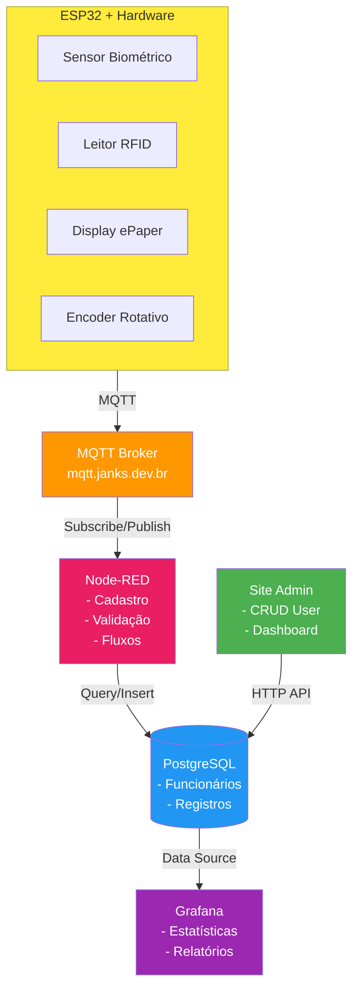

# PROJETO PONTO ELETRÔNICO IoT

## Visão Geral

Sistema de ponto eletrônico utilizando tecnologias IoT estudadas no curso, integrando hardware (ESP32) e software (web) para controle de acesso e registro de jornada de trabalho.

---

## Objetivos do Projeto

Desenvolver um sistema completo de ponto eletrônico que inclui:

- **Hardware**: ESP32 com sensores biométricos, RFID, display ePaper e encoder rotativo
- **Comunicação**: MQTT para envio de dados em tempo real
- **Backend**: Node-RED para processamento de fluxos e PostgreSQL para armazenamento
- **Frontend**: Site administrativo para gestão de funcionários e visualização de dados
- **Visualização**: Grafana para dashboards e estatísticas

---

## Arquitetura do Sistema



---

## Componentes de Hardware

### Lista de Componentes

1. **ESP32** (microcontrolador principal)
2. **Sensor Biométrico** (leitor de digital)
3. **Leitor RFID MFRC522** (leitura de tags/cartões)
4. **Display ePaper 2.9" WeAct** (interface visual)
5. **Encoder Rotativo** (detecção de direção - entrada/saída)
6. **PCB Customizada** (integração dos componentes)
7. **Caixa 3D** (case para o dispositivo)

### Pinagem

```cpp
// RFID MFRC522
#define RFID_SS_PIN 46
#define RFID_RST_PIN 17

// ePaper 2.9" WeAct
// GxEPD2_290_T94_V2(SS, DC, RST, BUSY)
// Pinos: 10, 14, 15, 16

// Encoder Rotativo
#define ENCODER_CLK_PIN 34
#define ENCODER_DT_PIN 35

// Sensor Biométrico (UART)
// Serial1: RX=47, TX=48
```

---

## Cronograma de Desenvolvimento

### FASE 1: Cadastro e Validação Biométrica

**Objetivos:**
- [ ] Configurar comunicação serial com sensor biométrico
- [ ] Implementar cadastro de digitais via serial
- [ ] Validar leitura e matching de digitais
- [ ] Integrar com MQTT para envio de dados

**Arquivos:**
- `biometria.cpp` (código ESP32)
- `fluxo_biometria.json` (Node-RED)

**Tópicos MQTT:**
- `ponto/biometria/cadastro` (envio de nova digital)
- `ponto/biometria/validacao` (validação de digital lida)
- `ponto/biometria/resposta` (resposta do servidor)

**Referências:**
- Resumo 03: Serial
- Resumo 05: MQTT
- Resumo 08: WiFi e MQTT

---

### FASE 2: Comunicação Biometria-MQTT-Banco

**Objetivos:**
- [ ] Criar fluxo Node-RED para processar dados biométricos
- [ ] Integrar com PostgreSQL para armazenar digitais cadastradas
- [ ] Implementar validação de funcionário no banco
- [ ] Registrar eventos de ponto (entrada/saída)

**Tabelas PostgreSQL:**
```sql
CREATE TABLE funcionarios (
    id SERIAL PRIMARY KEY,
    nome VARCHAR(100) NOT NULL,
    cpf VARCHAR(11) UNIQUE NOT NULL,
    cargo VARCHAR(50),
    departamento VARCHAR(50),
    ativo BOOLEAN DEFAULT true,
    digital_id INTEGER UNIQUE,
    rfid_uid VARCHAR(20) UNIQUE,
    data_cadastro TIMESTAMP DEFAULT NOW()
);

CREATE TABLE registros_ponto (
    id SERIAL PRIMARY KEY,
    funcionario_id INTEGER REFERENCES funcionarios(id),
    data_hora TIMESTAMP DEFAULT NOW(),
    tipo VARCHAR(10) CHECK (tipo IN ('entrada', 'saida')),
    metodo VARCHAR(15) CHECK (metodo IN ('biometria', 'rfid')),
    localizacao VARCHAR(50)
);

CREATE INDEX idx_registros_data ON registros_ponto(data_hora);
CREATE INDEX idx_registros_funcionario ON registros_ponto(funcionario_id);
```

**Referências:**
- Resumo 08: PostgreSQL
- Resumo 05: MQTT
- Resumo 07: Node-RED

---

### FASE 3: Site Administrativo (HTML/CSS)

**Objetivos:**
- [ ] Criar estrutura HTML do site admin
- [ ] Implementar design responsivo com CSS
- [ ] Criar páginas:
  - Login de administrador
  - Dashboard principal
  - CRUD de funcionários
  - Visualização de registros
  - Configurações

**Estrutura de Arquivos:**
```
/data/www/
├── index.html
├── login.html
├── dashboard.html
├── funcionarios.html
├── registros.html
├── css/
│   ├── style.css
│   ├── dashboard.css
│   └── responsive.css
└── js/
    ├── app.js
    └── api.js
```

**Funcionalidades:**
- Autenticação de admin
- Listagem de funcionários (tabela com filtros)
- Adicionar novo funcionário
- Editar dados de funcionário
- Desativar/ativar funcionário
- Visualizar registros de ponto por funcionário
- Exportar relatórios

**Referências:**
- Resumo 04: Web Server
- Resumo 04: LittleFS

---

### FASE 4: Layout ePaper e Modelagem Banco (CSS)

**Objetivos:**
- [ ] Finalizar CSS do site administrativo
- [ ] Projetar interface do display ePaper
- [ ] Implementar telas do ePaper:
  - Tela inicial ("Aproxime o cartão")
  - Verificando usuário
  - Acesso liberado (com nome e horário)
  - Acesso negado
  - Selecionar direção (entrada/saída)
- [ ] Otimizar queries do banco de dados
- [ ] Criar views para relatórios

**Layout ePaper (2.9" - 296x128px):**
```cpp
// Tela Inicial
fontes.setFont(u8g2_font_helvB24_te);
fontes.print("Aproxime TAG/Digital");

// Tela de Boas-vindas
fontes.setFont(u8g2_font_helvB18_te);
fontes.print("Bem-vindo,");
fontes.setFont(u8g2_font_helvB24_te);
fontes.print(nome_funcionario);
fontes.setFont(u8g2_font_helvR14_te);
fontes.print(data_hora_atual);
fontes.print("Gire para: [Entrada] [Saída]");

// Tela de Confirmação
fontes.print("Ponto registrado!");
fontes.print("Tipo: ENTRADA");
fontes.print("Horário: 08:32:15");
```

**Views PostgreSQL:**
```sql
-- View: Horas trabalhadas por dia
CREATE VIEW horas_diarias AS
SELECT 
    f.id,
    f.nome,
    DATE(r.data_hora) as data,
    SUM(CASE WHEN r.tipo = 'entrada' THEN -1 ELSE 1 END * 
        EXTRACT(EPOCH FROM r.data_hora)) / 3600 as horas
FROM funcionarios f
JOIN registros_ponto r ON f.id = r.funcionario_id
GROUP BY f.id, f.nome, DATE(r.data_hora);
```

**Referências:**
- Resumo 05: Display ePaper
- Resumo 08: PostgreSQL
- Resumo 04: Web Server (CSS templates)

---

### FASE 5: Modelagem PCB

**Objetivos:**
- [ ] Criar esquemático completo no KiCad/EasyEDA
- [ ] Definir dimensões e layout da PCB
- [ ] Rotear trilhas (power, sinais, GND)
- [ ] Adicionar conectores:
  - RFID (SPI)
  - ePaper (SPI)
  - Biometria (UART)
  - Encoder (GPIO)
  - Alimentação (USB-C ou DC Jack)
- [ ] Gerar Gerber files
- [ ] Encomendar PCB

**Checklist de Design:**
- [ ] Capacitores de desacoplamento (0.1µF) em todos os CIs
- [ ] Regulador de tensão (3.3V) se necessário
- [ ] Pull-ups/pull-downs nos botões e encoder
- [ ] Proteção ESD nas interfaces externas
- [ ] LED indicador de power
- [ ] Furos de montagem (M3)

---

### FASE 6: RFID + Display ePaper + Encoder

**Objetivos:**
- [x] Integrar RFID com display ePaper (código atual em `main.cpp`)
- [ ] Implementar máquina de estados completa
- [ ] Adicionar lógica do encoder rotativo para entrada/saída
- [ ] Testar fluxo completo:
  1. Aproximar TAG RFID
  2. Validar usuário
  3. Exibir nome no ePaper
  4. Aguardar rotação do encoder
  5. Registrar entrada ou saída
  6. Enviar via MQTT
- [ ] Implementar timeout (voltar ao início após 10s sem ação)

**Máquina de Estados:**
```cpp
enum Estado { 
    AGUARDANDO,      // Tela inicial
    LENDO_TAG,       // Lendo RFID/Biometria
    VALIDANDO,       // Consultando servidor
    LIBERADO,        // Usuário válido - aguarda direção
    REGISTRANDO,     // Enviando registro via MQTT
    CONFIRMADO,      // Exibe confirmação
    NEGADO,          // Acesso negado
    ERRO             // Erro de comunicação
};
```

**Tópicos MQTT:**
- `ponto/rfid/validacao` → `{uid: "AB:CD:EF:12"}`
- `ponto/rfid/resposta` ← `{valido: true, nome: "João Silva", id: 123}`
- `ponto/registro` → `{funcionario_id: 123, tipo: "entrada", timestamp: "..."}`

**Referências:**
- `main.cpp` (código atual)
- Resumo 05: RFID, ePaper, MQTT
- Resumo 02: GFButton (para encoder)

---

### FASE 7: Fluxos Node-RED (Bater Ponto e Cadastro)

**Objetivos:**
- [ ] Criar fluxo de validação RFID/Biometria
- [ ] Criar fluxo de registro de ponto
- [ ] Criar fluxo de cadastro de novo funcionário
- [ ] Implementar lógica de horários (tolerância de entrada)
- [ ] Notificações (Telegram/Email) para eventos importantes
- [ ] Dashboard Node-RED para monitoramento

**Fluxos Principais:**

1. **Validação de Acesso**
```
[mqtt in: ponto/rfid/validacao]
    → [function: buscar_funcionario]
    → [postgres: SELECT * FROM funcionarios WHERE rfid_uid = $uid]
    → [switch: funcionario existe?]
        → [mqtt out: ponto/rfid/resposta] (válido)
        → [mqtt out: ponto/rfid/resposta] (inválido)
```

2. **Registro de Ponto**
```
[mqtt in: ponto/registro]
    → [function: validar_dados]
    → [postgres: INSERT INTO registros_ponto]
    → [function: calcular_horas]
    → [switch: atraso?]
        → [telegram: notificar_admin]
    → [debug: log_registro]
```

3. **Cadastro de Funcionário**
```
[http in: POST /api/funcionario]
    → [function: validar_dados]
    → [postgres: INSERT INTO funcionarios]
    → [mqtt out: ponto/cadastro/novo] (notifica ESP32)
    → [http response: 201 Created]
```

**Referências:**
- Resumo 07: Node-RED
- Resumo 08: PostgreSQL
- Resumo 05: MQTT

---

### FASE 8: Modelagem da Caixa (Case 3D)

**Objetivos:**
- [ ] Medir dimensões de todos os componentes
- [ ] Projetar case 3D no Fusion 360/FreeCAD
- [ ] Criar compartimentos para:
  - PCB principal
  - Display ePaper (visível no topo)
  - Sensor biométrico (acesso frontal)
  - Antena RFID (embutida)
  - Encoder (lateral)
- [ ] Adicionar suportes e encaixes
- [ ] Criar tampa traseira com parafusos
- [ ] Exportar STL para impressão 3D
- [ ] Imprimir protótipo
- [ ] Ajustar e imprimir versão final

**Especificações:**
- Material: PLA ou PETG
- Furos para ventilação (se necessário)
- Slot para cabo USB (programação)
- Montagem em parede (furos na traseira)
- Acabamento profissional

---

## Tecnologias e Ferramentas

### Hardware
- **Plataforma**: ESP32 (Arduino Framework)
- **IDE**: Arduino IDE ou PlatformIO

### Software
- **Backend**: Node-RED
- **Banco de Dados**: PostgreSQL + TimescaleDB (opcional)
- **Broker MQTT**: Mosquitto
- **Visualização**: Grafana
- **Frontend**: HTML5 + CSS3 + JavaScript (Vanilla ou framework leve)

### Bibliotecas ESP32
```cpp
#include <WiFi.h>              // Conexão WiFi
#include <MQTT.h>              // Cliente MQTT
#include <WiFiClientSecure.h>  // MQTT seguro
#include <SPI.h>               // Comunicação SPI
#include <MFRC522.h>           // Leitor RFID
#include <GxEPD2_BW.h>         // Display ePaper
#include <U8g2_for_Adafruit_GFX.h> // Fontes
#include <ESP32Encoder.h>      // Encoder rotativo
#include <ArduinoJson.h>       // JSON para MQTT
```

---

## Integração Grafana

### Dashboards Planejados

1. **Visão Geral**
   - Total de funcionários ativos
   - Registros de hoje
   - Taxa de presença
   - Alertas de atrasos

2. **Por Funcionário**
   - Histórico de pontos (últimos 30 dias)
   - Horas trabalhadas por semana
   - Média de horário de entrada/saída
   - Gráfico de tendência

3. **Departamento**
   - Comparação de presença entre setores
   - Heatmap de horários de pico
   - Relatório de horas extras

### Query Exemplo (TimescaleDB)
```sql
SELECT
    time_bucket('1 day', data_hora) AS dia,
    COUNT(*) FILTER (WHERE tipo = 'entrada') as entradas,
    COUNT(*) FILTER (WHERE tipo = 'saida') as saidas
FROM registros_ponto
WHERE $_timeFilter(data_hora)
GROUP BY dia
ORDER BY dia ASC;
```

**Referências:**
- Resumo 08: Grafana
- Resumo 08: TimescaleDB

---

## Segurança

### Considerações
- [ ] Senha WiFi e MQTT não hardcoded (usar LittleFS)
- [ ] MQTT com TLS (porta 8883)
- [ ] Autenticação de admin no site
- [ ] Hash de senhas no banco (bcrypt)
- [ ] Sanitização de inputs SQL (prepared statements)
- [ ] Rate limiting nas APIs
- [ ] Logs de acesso e auditoria

---

## Testes

### Checklist de Testes

**Hardware:**
- [ ] Leitura de RFID consistente
- [ ] Display ePaper atualiza corretamente
- [ ] Encoder detecta rotação e direção
- [ ] Sensor biométrico cadastra e valida digitais
- [ ] Comunicação MQTT estável

**Software:**
- [ ] Node-RED processa todos os fluxos
- [ ] Banco de dados persiste dados corretamente
- [ ] Site admin carrega e responde
- [ ] Grafana exibe dados em tempo real
- [ ] Validação de funcionário < 2 segundos

**Integração:**
- [ ] Fluxo completo: RFID → Validação → Registro → Exibição
- [ ] Cadastro via site reflete no hardware
- [ ] Relatórios Grafana batem com registros
- [ ] Sistema se recupera de queda de conexão

---

## Melhorias Futuras

- [ ] Reconhecimento facial (ESP32-CAM)
- [ ] App mobile para funcionários
- [ ] Geolocalização (GPS)
- [ ] Notificações push
- [ ] Integração com sistemas de folha de pagamento
- [ ] Modo offline com sincronização posterior
- [ ] Multi-idiomas
- [ ] Backup automático do banco

---

## Referências

- **Resumo 02**: Botões (GFButton para encoder)
- **Resumo 03**: Serial (biometria)
- **Resumo 04**: Web Server, LittleFS
- **Resumo 05**: RFID, ePaper, MQTT Seguro
- **Resumo 07**: Node-RED
- **Resumo 08**: PostgreSQL, TimescaleDB, Grafana

---

## Contatos e Repositório

- **Desenvolvedor**: Eduardo
- **Repositório**: `/home/eduardo/PROJ-IOT/projeto-iot`
- **Arquivos Principais**:
  - `main.cpp` - Firmware ESP32
  - `projeto.md` - Este documento
  - `resumo.md` - Referências técnicas

---

**Última atualização**: 03/11/2025
